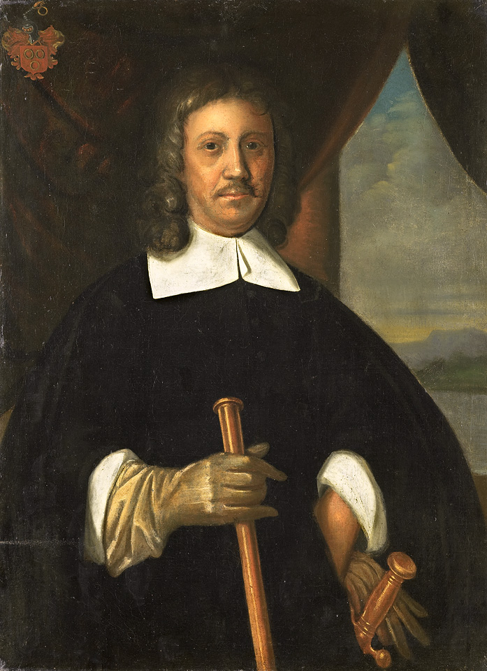

# The Political History of South Africa
We experienced the closure of the second phase of the political history of South Africa
when the newly elected black democratic government took office in 1994.
The first phase was characterized by Portuguese- Dutch- and English settlers who
governed the country from 1488.
In 1652 with the arrival of Jan van Riebeeck the second phase commenced and lasted
until 1994.

Initially, the colonists established themselves along the coastal areas, and later they
emigrated to the east and north of the country. As they populated the country, they took
over control. In the process, there were several clashes between the whites and the
blacks who migrated southwards from the north of Africa. The Europeans, however,
prevailed, and the land conquered was occupied and controlled. Local-provincial and
national authorities were established and the necessary legislation promulgated.
As the years passed, major problems developed due to the dramatic increase in the
number of black people, as a result of population growth and inflows from other African
countries. Over time, this became a nettle for the South African politics. The last fifty
years of the three hundred and fifty years of the second phase was under control of the
Afrikaans-speaking population that was led by the National Party. It was during this
period that the black populations, led by Mandela and others have decided to work out
their own salvation, and not to wait for the Europeans to do it.
The third phase of the political history of South Africa is characterized by the fact that it
is the first time in the history of the country that there is not a minority government in
power, but a democratically elected government elected by all the residents of SA.
# New is not always better
In 1996, the United Nations HUMAN DEVELOPMENT REPORT reported that in 100
of the 160 member states (of which South Africa was one of them) the residents were
worse off than was the case in 1980. The report also found that the per capita income
of the poor countries started to decrease. During the same year the World Bank
reported that 20% of the world’s population income was less than one US dollar a
day. In the developing world, the per capita income is a hundred dollars a month to
two thousand five hundred dollars in the developed world.
The extreme poverty in the world, as in South Africa, is a very unpleasant reality. A
further reality is that the poor becomes, poorer and the rich, richer, and the gap
between rich and poor are growing despite all efforts to stop it.
One of the consequences of this situation is an increase in crime. For many people,
stealing is the only alternative to obtain food.
The question arises, namely, who or what is the cause of this state of affairs? To my
mind there are several reasons. The following are the most important, namely the
tremendous population explosion and the globalization of the world economy, as well
as the deterioration in the quality of world governments.
The poor man's wealth is his number of children. The answer is however that the
population growth should decrease, not increase, so that fewer people share in the
cake, and everyone gets a bigger slice.
It is generally accepted that poverty refers primarily to inadequate access to material
assets, but it can also mean lack of access to non-material assets such as resources.
The interaction between physical disability and vulnerability in terms of unemployment
must also be taken into account.
The following information became known recently and shocked:
• Children are disproportionately affected by poverty. 50% of all people in South Africa
live in poverty, while 62% of all children live in poverty.
• Only 33% of children live with both parents, while 23, 9% do not live with their
parents.
• 3, 3% of children live with their father and 39, 3% live with their mother.
• Elderly blacks (15.3%) suffer more from hunger than colored people (9.3%), Indians
(3.0%), while the figure is only (0.6%) in the case of whites.
• Despite the fact that South Africa allocates 18, 5% of the annual budget to education
the education system is generally in a very poor condition. Sixty-six percent of the
children who started school in 2001 dropped out of school before the matriculation
examination.
According to the World Economic Forum report, South Africa's mathematics and
science standards is the second lowest in the world. We find that the government
boasts the metric results as a pass figure of 79%. Many of them cannot even read or
write.
Another consequence of poverty and avarice is corruption. In 2011, Parliament was
informed that between R25 billion and R30 billion from the government's annual
budget goes for corruption and incompetence. Money that could be used to alleviate
the problem of poverty.
The number of orphans in South Africa totals three point nine five million. Nearly ten
percent of the total population.

